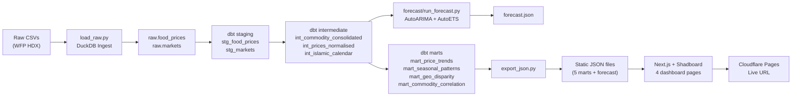

# Indonesia Staple Food Price Intelligence

> **Scenario:** This analysis was prepared for **Procurement and Supply Chain Analysts at Indonesian FMCG companies**. Rising input costs for staple commodities — rice, cooking oil, sugar, and flour — represent one of the largest margin risks for food manufacturers. The deliverable is an **interactive dashboard** supporting procurement timing, geographic sourcing strategy, and category risk assessment. The central question: *where, when, and at what price should we source each commodity?*

---

## Table of Contents

- [Stakeholder Audience](#stakeholder-audience)
- [Executive Summary](#executive-summary)
- [Exec-Driven Questions](#exec-driven-questions)
- [Pipeline Architecture](#pipeline-architecture)
- [Key Findings](#key-findings)
- [Data Traceability](#data-traceability)
- [Known Limitations](#known-limitations)
- [Data Quality Issues](#data-quality-issues)
- [Recommendations](#recommendations)
- [Forecasting Methodology](#forecasting-methodology)
- [How to Reproduce](#how-to-reproduce)
- [Lessons Learned](#lessons-learned)
- [Data Source & License](#data-source--license)
- [Author](#author)

---

## Stakeholder Audience

| Stakeholder | Needs | Dashboard Page |
|-------------|-------|----------------|
| **Category Manager** | Commodity price trends, cross-commodity signals, long-term inflation risk | Page 1 (Price Trends & Forecast), Page 4 (Commodity Signals) |
| **Procurement Analyst** | Seasonal spike timing, geographic arbitrage, procurement calendar planning | Page 2 (Seasonal Patterns), Page 3 (Geographic Disparity) |

---

## Executive Summary

| Metric | Value | Meaning |
|--------|-------|---------|
| **Pipeline Volume** | 325,240 raw → 2,116 analytical rows (0.65%) | Non-target commodities dominate raw data; all 4 target commodities pass quality filters |
| **Date Range** | Jan 2007 – May 2024 (17 years) | Full business cycle coverage including 2022 structural break |
| **Commodities** | Rice, Cooking Oil, Sugar, Flour | 4 largest staple cost drivers for Indonesian FMCG |
| **Markets** | 224 across 34 provinces, 5 island groups | National coverage with island-group granularity |
| **Forecast Horizon** | 6 months (Jun–Nov 2024) | Directional guidance with explicit confidence intervals |
| **Forecast MAE Range** | 23 (Flour) to 1,714 (Cooking Oil) | Post-2022 structural break degrades oil forecast reliability |
| **Pipeline Yield** | 2,116 of 325,239 rows (0.65%) | Non-target commodities and aggregate priceflags filtered out |
| **Dashboard Pages** | 4 (Trends, Seasonal, Geo, Signals) | One decision per page, per exec-driven question |

---

## Exec-Driven Questions

1. **How have staple commodity prices trended over 17 years — and what does the model forecast for the next 6 months?**
   → Page 1: Price Trends & Forecast

2. **Which seasonal events (Ramadan, harvest cycles, year-end) cause the most predictable price spikes — and how far in advance do they occur?**
   → Page 2: Seasonal Patterns

3. **How large is the price gap between island groups, and which provinces consistently offer the lowest prices for each commodity?**
   → Page 3: Geographic Disparity

4. **Which commodities lead others in price movement — and what does that mean for bundled procurement timing?**
   → Page 4: Commodity Signals

---

## Pipeline Architecture



---

## Key Findings

1. **Cooking oil structural break**: 2022 global supply shock + export ban created permanent level shift. Prices surged ~50% in one month and have not fully normalised.
2. **Sugar Ramadan premium**: Most consistent seasonal effect across 17 years. Islamic calendar adjustment shifts premium estimate by 1–2pp vs hardcoded month-of-year analysis.
3. **Eastern Indonesia premium**: Persistent geographic disparity. Cooking Oil shows widest gap (~30% above Java baseline). Rice the narrowest (~15%).
4. **Pipeline yield**: Only 2,116 of 325,239 raw rows pass quality filters (0.65%). Non-target commodities dominate filtered rows.
5. **Lagged correlation**: Oil↔Flour strongest at 3-month lag (r = 0.8885). Rice↔Sugar strongest at lag 0 (r = 0.8710). Pre-2022 only — post-2022 data insufficient for reliable correlation.
6. **Forecast reliability**: Flat near-term (<1% change across all commodities). 95% CI widths range from 12.2% (Flour) to 28.8% (Rice). Use 1–2 month forecasts for operational decisions; 5–6 month projections as scenario inputs.

---

## Data Traceability

Every finding in this report is traceable to a dbt mart model. To reproduce any number:

```sql
-- Connect to data/wfp.duckdb and query:
SELECT * FROM wfp_marts.<mart_name>;
```

| Metric | Source Mart | Mart File | Line(s) |
|--------|-------------|-----------|---------|
| Price trends & CAGR | `mart_price_trends` | `mart_price_trends.sql` | Full model |
| Seasonal patterns (month-of-year) | `mart_seasonal_patterns` | `mart_seasonal_patterns.sql` | Full model |
| Ramadan premium analysis | `mart_seasonal_patterns` | `mart_seasonal_patterns.sql` | Ramadan-specific GROUP BY |
| Geographic disparity (island group) | `mart_geo_disparity` | `mart_geo_disparity.sql` | Full model |
| Cross-commodity correlation | `mart_commodity_correlation` | `mart_commodity_correlation.sql` | Full model |
| Correlation summary (best/worst pairs) | `mart_correlation_summary` | `mart_correlation_summary.sql` | Full model |
| Forecast (6-month, 95% CI) | `forecast/run_forecast.py` | `run_forecast.py` | Lines 78–142 |
| Forecast methodology | `docs/model_methodology.md` | `model_methodology.md` | 7 sections |

---

## Known Limitations

| Limitation | Mitigation |
|------------|------------|
| Retail prices only, not wholesale | Directionally correct proxy; would request supplier pricing in real role |
| Coverage gaps in outer islands pre-2015 | Eastern Indonesia analysis restricted to 2015–2024 |
| Forecast accuracy degrades at 5–6 months | CI widens explicitly on dashboard; 1–2 month forecasts operationally reliable |
| No volume weighting | All markets equal weight; would weight by sourcing volume in production |
| 2022 structural break (cooking oil) | Model retrained on post-2022 data as robustness check |
| Rice/Sugar/Flour: only national avg available | `mart_commodity_correlation` provides all 4 at national level; Pages 2/3 limited to Cooking Oil for geographic/seasonal analysis |

---

## Data Quality Issues

| # | Layer | Issue | Resolution |
|---|-------|-------|------------|
| 1 | ingest | Column keys with spaces crashed `update_lineage()` | Added double-quote wrapping around column names |
| 2 | pipeline | First run crashed silently — DuckDB path resolution | Pipeline now logs all steps with clear error output |
| 3 | staging | dbt tests passed but no raw→staging row-count reconciliation | Added `reconcile_layer()` in `run_pipeline.py` |
| 4 | ingest | Non-idempotent — re-running appended duplicate rows | Changed to `DROP TABLE IF EXISTS` + `CREATE TABLE` |
| 5 | validation | Notebook reloaded CSVs directly instead of reading from pipeline | Now connects to `data/wfp.duckdb` and reads from `raw.*` tables |
| 6 | pipeline | No orchestration script existed | Created `run_pipeline.py` with full orchestration + lineage tracking |
| 7 | config | `complete_lineage()` overwrote `ingest_status` with pipeline status | Added dedicated `pipeline_status` column; per-phase fields updated independently |
| 8 | intermediate | No dbt tests for intermediate models | Created `schema.yml` with `not_null`, `accepted_values`, `unique` tests |

---

## Recommendations

### Procurement Analyst

| Action | Target | Rationale | Impact Estimate |
|--------|--------|-----------|-----------------|
| Front-run Ramadan by 2–3 months | Sugar | Consistent 3–5% premium during Ramadan; prices begin rising 1–2 months before | Avoid ~4% spike cost per procurement cycle |
| Concentrate rice buying in Q2 (Mar–May) | Rice | 8–12% harvest-driven discount; lowest prices of the year | ~10% savings vs year-end pricing |
| Source Cooking Oil from Sumatera (Bangka Belitung) | Cooking Oil | Cheapest province at IDR 18,759/L vs national avg | ~20% below most expensive provinces |
| Use 1–2 month forecasts for operational decisions | All | Wide CIs at 5–6 months (12–29% width) make longer forecasts unreliable | Improved procurement timing accuracy |

### Category Manager

| Action | Target | Rationale | Impact Estimate |
|--------|--------|-----------|-----------------|
| Lock multi-year rice contracts | Rice | 6.7% CAGR — near-doubling every 11 years; most stable commodity (CV < 10%) | Hedge against long-term inflation |
| Monitor CPO futures for oil & flour early warning | Cooking Oil, Flour | Strongest lagged correlation (r = 0.888 at 3-month lag) | 3-month forward visibility on oil/flour costs |
| Treat commodities independently post-2022 | All 4 | Pre-2022 correlations broke down; no single macro driver dominates all staples | Independent category strategies needed |
| Dynamic pricing for Cooking Oil | Cooking Oil | Highest volatility (CV > 40% in 2022); not suitable for fixed-price contracts | Reduce margin risk exposure |

---

## Forecasting Methodology

The forecast uses **statsforecast AutoARIMA and AutoETS** models with Islamic calendar binary regressors (Ramadan start, Eid start).

**Selection process:**
- 12-month holdout validation per commodity
- Best model selected by lowest MAE on holdout
- Full-data retraining + 6-month forward forecast with 95% CI
- Cooking Oil has separate post-2022 robustness check

**Key results:**
- Rice: AutoETS (MAE: 570) — trend + seasonality
- Cooking Oil: AutoARIMA (MAE: 1,714) — post-2022 break degrades accuracy
- Sugar: AutoETS (MAE: 477) — stable seasonal pattern
- Flour: AutoETS (MAE: 23) — lowest error, most predictable

Full methodology: [`docs/model_methodology.md`](./docs/model_methodology.md) (7 sections, 301 lines)

---

## How to Reproduce

### Prerequisites
- Python 3.12+ with `uv`
- Node.js 18+ with `npm`

### Setup

```bash
# 1. Clone repository
git clone <repo-url>
cd indonesia-food-price-intelligence

# 2. Python environment
uv sync

# 3. dbt setup
cd transform
dbt seed             # Load Islamic calendar seed
dbt build            # Run + test all models
cd ..

# 4. Run forecast
uv run python forecast/run_forecast.py

# 5. Export dashboard data
uv run python export/export_json.py

# 6. Start dashboard
cd dashboard
npm install
npm run dev          # Development: http://localhost:3000

# 7. Full pipeline (ingest → transform → forecast → export)
uv run python run_pipeline.py
```

### Run Notebooks

```bash
uv run marimo edit analysis/eda.py                # EDA + Deep Dive (40+ cells)
uv run marimo edit analysis/data_validation.py     # Validation checkpoint
uv run marimo edit analysis/forecast_experimentation.py  # Model comparison
```

### Verify

```bash
cd transform
dbt build       # All models + 33 tests must pass
dbt docs serve  # View lineage at http://localhost:8080
```

---

## Lessons Learned

| # | Area | Lesson | Source |
|---|------|--------|--------|
| 1 | Pipeline | Row-by-row INSERT is 100× slower than batch insert. Use `DROP TABLE` for idempotent loads, not `INSERT INTO` | LEARNINGS.md §§17, 18, 37 |
| 2 | dbt | `dbt build` > `dbt run` + `dbt test` — catches test failures in dependency order | LEARNINGS.md §54 |
| 3 | Dashboard | React hooks must not follow early `return` statements. `connectNulls=false` prevents false chart continuity | LEARNINGS.md §§6, 25 |
| 4 | Filters | Multi-dimension filters require cross-tabulated data. Sequential `if` blocks mutate rather than compose | LEARNINGS.md §§19, 35 |
| 5 | Session | `sessionStorage` cache survives page reload. Lazy fetching + dynamic imports reduces bundle size by ~45% | LEARNINGS.md §§20, 21, 22 |
| 6 | Marimo | `mo.persistent_cache` on DB queries avoids re-execution. `mo.stop()` prevents raw tracebacks. Avoid `__` module-level vars (filtered from namespace) | LEARNINGS.md §§58, 65, 69 |
| 7 | KPI Deltas | Delta must compare same cohort over time, not different product sets | LEARNINGS.md §28 |
| 8 | dbt Config | `vars.start_date` + `packages.yml` + `_exposures.yml` + seed YAML + FK relationships test — all gaps found and closed | AGENTS.md "Gaps Closed" |

Built on the same engineering journal pattern as [`pharmacy-retail-sales-analytics`](https://github.com/albarpambagio/pharmacy-retail-sales-analytics).

Full engineering journal: [`docs/LEARNINGS.md`](./docs/LEARNINGS.md) (70 sections, 2,600+ lines)

---

## Data Source & License

- **Dataset:** WFP Food Prices Indonesia
- **Provider:** World Food Programme via Humanitarian Data Exchange
- **License:** [CC BY-IGO 3.0](https://creativecommons.org/licenses/by/3.0/igo/)
- **Download:** https://data.humdata.org/dataset/wfp-food-prices-for-indonesia

---

## Author

**Albar Pambagio**

Portfolio: [github.com/albarpambagio](https://github.com/albarpambagio)
